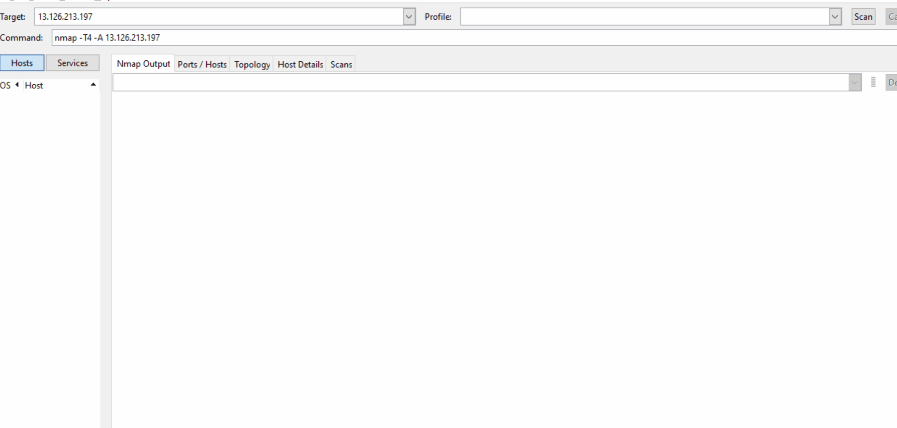

# Honeypot Assignment

**Time spent:35 hours spent in total

### MHN-Admin Deployment (Required)

**Summary:** I have used AWS for the deployment.

### Dionaea Honeypot Deployment

Dionaea effective at detecting and/or collecting data about an attack and attacker.

MHN uses MongoDB as RDBMS and the exported JSON file contains the information related to the attacks against the honepot.

